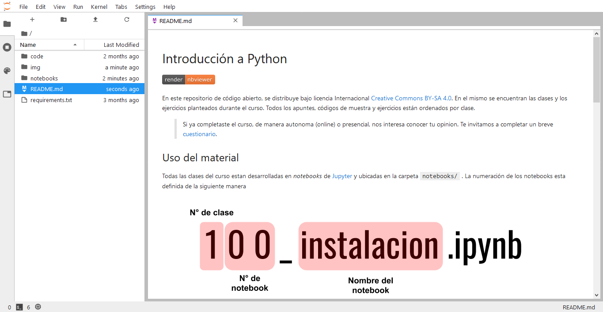

# Señales y Sistemas - Ingeniería de Sonido - Universidad Nacional de Tres de Febrero 


Repositorio con el contenido práctico de la asignatura Señales y Sistemas de la carrera [Ingeniería de Sonido](https://www.untref.edu.ar/carrera/ingenieria-de-sonido), en la [Universidad Nacional de Tres de Febrero](https://www.untref.edu.ar), Buenos Aires - Argentina.

El contenido esta orientado para alumnos con algún conocimiento previo de programación y de ninguna manera pretende ser un curso de programación en Python, sino más bien un material de apoyo intenso y desafiante, que invita a pensar y a desarrollar soluciones para validar los resultados analíticos de las [guiá de la asignatura](guia_ejercicios.pdf).

> ❗ La distribución de la clases se encuentra en el siguiente [link](clases/README.md).


## Como comenzar
Todas las clases de este repositorio están desarrolladas en *notebooks* de [Jupyter](https://jupyter.org/). La numeración de los notebooks esta definida de la siguiente manera


> Es importante aclarar, cuando mencionemos **notebook**, se hará referencia al archivo .ipynb, en lugar al programa de **Jupyter Notebook**. El termino **notebook** se hereda de [IPython](https://es.wikipedia.org/wiki/IPython).

Para **usar** el material de este repositorio se puede optar varios caminos:

* De manera online:
    * [GitHub](https://github.com/maxiyommi/signal-systems) o desde [nbviewer](https://nbviewer.jupyter.org/github/maxiyommi/signal-systems/tree/master/). En ambos casos son una web estática, esto quiere decir que **no podemos interactuar con el material**.
    * [Google Colab](https://colab.research.google.com/notebooks/intro.ipynb#recent=true) o [Blinder](https://mybinder.org/), **podemos interactuar con el material**.

* De manera offline:
    * Instalar un interprete de notebooks como [Jupyter](https://jupyter.org/), con ayuda del siguiente [instructivo](https://gist.github.com/maxiyommi/a21fa6af877d1e00f1498e60654e6c4a).
    
    * Descargar el material del repositorio:
        * Con `git` instalado en nuestro sistema operativo, la forma más fácil de acceder a estos archivos es clonar el repositorio en el directorio que elija.
``` bash
    git clone https://github.com/maxiyommi/signal-systems.git
```
        * Sin `git` instalado, puede descargar todo el repositorio como un archivo .zip desde la página de inicio del repositorio utilizando el botón verde "Clonar o descargar" en la esquina superior derecha.


> Para conocer más sobre git, se recomienda leer el siguiente [documento](https://gist.github.com/maxiyommi/b5d2ef4c66f17870a92bc27f4afe71c2) de ayuda.


## Utilizar el material del repositorio
Una vez que el entorno de desarrollo está [instalado y configurado](https://gist.github.com/maxiyommi/a21fa6af877d1e00f1498e60654e6c4a) y descargado el material. Luego, abrir una terminal del sistema operativo en la carpeta que se descomprimió el material. 


> **Nota:** es importante que la dirección que aparezca en la línea de comandos sea la correspondiente a la carpeta del curso (ej. "signal-systems/python/notebooks"), o determinados elementos, como las imágenes incrustadas no se visualizarán correctamente.

Aparecerán unas cuantas líneas y se abrirá tu navegador web predefinido. **No hace falta disponer de conexión a Internet**. Lo que está ocurriendo es que "tu navegador está mostrando lo que le manda el programa que se está ejecutando desde la línea de comandos". Así que no cierres la línea de comandos (terminal) hasta que termines de usar el notebook y ya lo hayas guardado y cerrado en tu navegador.

En esa ventana de tu navegador puedes moverte por las carpetas y ver los archivos con extensión .ipynb. Ve a la carpeta **notebooks** y abre la primera clase haciendo click sobre ella. 



## Clases

La distribución del material clase a clase se encuentra en el siguiente [link](clases/README.md)

## Trabajo práctico
El material referido al trabajo práctico se encuentra en la carpeta [`trabajo_practico`](trabajo_practico/readme.md). Las presentaciones se realizan en el dia y horario de las prácticas de la asignatura. **Todas las actividades son obligatorias**.

## Contenido teórico
Ingresar con el usuario personal al [**Aula virtual**](https://presenciales.untref.edu.ar/acceso.cgi).

## Consultas
Las consultas sobre el material y/o consigna del TP están centralizadas en el espacio de trabajo de [Slack](https://slack.com/intl/es-ar/). Por favor consultar el [siguiente documento](https://github.com/maxiyommi/signal-systems/blob/master/reglas_slack.md) para realizar las consultas apropiadamente.
* [Unirte al espacio de trabajo](https://join.slack.com/t/senalesysistemas/shared_invite/zt-o44s05m8-Yhw_W10tEch6fBy~e8mo2w)

## Bibliografia recomendada para seguir las clases
La mayor parte del contenido teórico de este curso fue extraida de: 

* Varoquaux, G., Gouillart, E., Vahtras, O., Haenel, V., Rougier, N. P., Gommers, R., ... & Pinte, D. *Scipy lecture note*, 2015
* Van Rossum, Guido; Drake, Fred L. *The python language reference manual*. Network Theory Ltd., 2011.

## Sitios de interes
* https://realpython.com
* https://medium.com/
* https://stackoverflow.com/

## Docentes
* **Lic. [Miriam Sassano](https://www.linkedin.com/in/miryam-patricia-sassano-7878189)** - miryam.sassano@gmail.com
* **Ing. Antonio Greco** - antogreco2015@gmail.com
* **Ing. [Maximiliano Yommi](https://www.linkedin.com/in/myommi)** - myommi@untref.edu.ar
* **Sr. [Gonzalo Rodriguez Jannots](https://www.linkedin.com/in/gonzalo-rodr%C3%ADguez-jannots-568077174)** - rodriguez45984@estudiantes.untref.edu.ar

## Licencia
<a rel="license" href="http://creativecommons.org/licenses/by-sa/4.0/"></a><br />Este documento se destribuye con una <a rel="license" href="http://creativecommons.org/licenses/by-sa/4.0/">licencia Atribución CompartirIgual 4.0 Internacional de Creative Commons</a>.
© 2022 (CC BY-SA 4.0).
